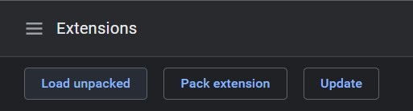
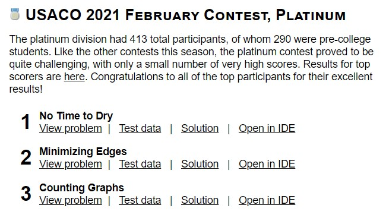

This is a Chrome extension which creates a link next to USACO problems to open up the problem in usaco.guide's online IDE.

## Setup
Download the folder `USACO + Guide IDE Integration` and open up the extensions tab in Chrome: `chrome://extensions/`.

Enable Developer Mode and click `Load Unpacked`. 

Select the downloaded folder.

---

## Showcase

